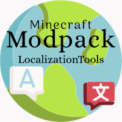

<div align="center">
  
  <h1>MCPackLocalizer</h1>
  <p>Minecraft 整合包本地化工具 · 从内容提取到翻译补丁生成</p>
  <a href="https://github.com/XDawned/MCPackLocalizer/releases">
    
  </a>
  <a href="https://www.python.org/">
    
  </a>
  <a href="LICENSE">
    
  </a>
</div>

**MCPackLocalizer 帮你把 Minecraft 整合包中的任务、帕秋莉手册、模组语言和脚本显示文本翻译为对应语言，生成可安装的汉化补丁**


## 项目亮点

- **本地与 API 自由选择**：支持使用预设的 HY-MT-2 等本地翻译小模型离线运行，也支持使用 OpenAI 兼容、Anthropic、Gemini API等大语言模型获得更好的翻译效果。
- **面向 Minecraft 的翻译**：内置术语库、禁翻规则和可编辑的提示词模板，保护占位符、颜色代码、资源 ID 等内容，并提示译文质量问题。
- **大任务可暂停、可续跑**：自动保存翻译进度，支持人工校润、失败项重试；整合包更新时可对比版本差异，复用已审核译文和模组共享译库。
- **支持增量翻译**：同整合包升级可选择复用上版本已处理内容，减少翻译工作量。
- **全流程可视化**：Fluent 风格桌面界面，提供资源预览、实时进度、译文筛选、批量修润，以及独立的翻译测试。
- **辅助工具**：继承原[FTBQLocalizationTools](https://github.com/XDawned/FTBQLocalizationTools)部分功能，内置FTB任务语言文件提取、回填等小工具

### 可以翻译哪些内容？

| 内容 | 支持范围 |
| --- | --- |
| FTB Quests 与整合包语言文件 | 任务文本、SNBT / JSON5 / NBT 及整合包自带语言资源 |
| 帕秋莉（Patchouli）手册 | 整合包、资源包和模组归档中的手册，导出目标语言资源包；部分内容生成 JAR 补丁 |
| 模组缺失汉化 | 扫描语言覆盖率，结合 CFPA 汉化包和共享译库补充翻译，目前支持 `en_us → zh_cn` |
| KubeJS | 脚本显示文本、assets JSON 文本和语言文件；脚本翻译需单独配置大模型 API |

### 目前预设的翻译模型

| 模型预设 | 运行方式 | 模型文件大小 | 说明 |
| --- | --- | --- | --- |
| [HY-MT-2 1.8B](https://huggingface.co/tencent/Hy-MT2-1.8B-GGUF) | 本地 | 约 1.13 GB | 腾讯混元专用翻译模型的小参数版本，资源占用较低，可离线翻译。 |
| [HY-MT-2 7B](https://huggingface.co/tencent/Hy-MT2-7B-GGUF) | 本地 | 约 4.62 GB | 腾讯混元专用翻译模型的 7B 版本，需要更多内存或显存。 |
| [Index-Translate 2B](https://huggingface.co/IndexTeam/Index-Translate-2B-GGUF) | 本地 | 约 1.31 GB | 哔哩哔哩专用翻译模型的小参数版本，资源占用较低，可离线翻译。 |
| [Index-Translate 9B](https://huggingface.co/IndexTeam/Index-Translate-9B-GGUF) | 本地 | 约 5.78 GB | 哔哩哔哩专用翻译模型的 9B 版本，需要更多内存或显存。 |
| [Index-Translate-35B-A3B](https://index-translate.bilibili.com/?p=/site/home.html) | 官方 API | 无需下载 | 使用哔哩哔哩官方的免费翻译接口，无需密钥；需要联网，服务可用性以官方为准。 |

本地预设均使用 `Q4_K_M` 量化，可在“添加接口”中下载或选择已有文件。表中大小为模型下载体积，实际运行还需额外内存或显存。

### 局限
- 目前暂时只支持 **`en -> zh`** 方向上的完整处理，其它方向的翻译仍然支持，但由于缺少术语词典仅保留基础翻译功能

## 桌面端快速上手

### 1. 下载并启动

面向 **Windows 10/11 x64**。从 [Releases](https://github.com/XDawned/MCPackLocalizer/releases) 下载适合设备的桌面 ZIP：

| 软件包 | 适用设备 |
| --- | --- |
| 通用 CPU | 没有可用独显，或希望使用 CPU 推理 |
| AMD Vulkan | AMD 显卡；其它支持 Vulkan 的显卡也可尝试 |
| NVIDIA CUDA | 驱动兼容 CUDA 12.4 的 NVIDIA 显卡 |

**完整解压后运行 `MCPackLocalizer.exe`**。发布包已包含 Python 和推理运行时，无需另外安装开发环境。
GGUF 模型不随软件包分发，可在程序中下载，或选择已有模型文件。包内 `使用说明.html` 含完整截图，可离线阅读。

### 2. 配置翻译接口

进入“接口管理”，按需要选择一种方式：

- **本地模型**：点击“添加接口”→“本地 GGUF”，选择已有模型，或选择 HY-MT-2 / Index-Translate 预设下载；选好配套模板后保存并激活。内存或显存较少时，可先尝试 `1.8B` / `2B` 小模型。
- **API 翻译**：点击“添加接口”，选择供应商，填写模型、地址及所需密钥，选择翻译模板；通过接口卡片菜单“测试接口”，确认后“激活接口”。也可连接本地兼容 API 服务。
- **内置接口**：程序内置 `Index-Translate · 官方免费 API` 配置，无需密钥或下载模型即可尝试；服务可用性以官方为准。

本地模型可以在“设置 → 本地推理”检查推理环境；发布版的推理解释器留空即可自动使用内置运行时。
正式批量翻译前，可在“翻译测试”页试译一段文本，检查术语、格式和提示词效果。

KubeJS **脚本翻译**与 **API 批量修润**需要“大模型”类型的 API 接口，可与主要翻译接口分别选择。

### 3. 识别、翻译与校润

1. 在“设置”确认原文和译文语言；默认汉化场景使用英语到简体中文。
2. 进入“整合包”，选择包含 `config`、`kubejs`、`mods` 等目录的**游戏实例根目录**，并选择**实例之外的新空任务目录**。
3. 勾选识别范围并开始识别。识别不调用翻译模型，可先预览发现的原文。
4. 进入“翻译”，点击“开始翻译”。需要中断时点击“暂停翻译”，之后打开已有任务继续处理。
5. 进入“校润”，筛选失败或待检查条目，修改译文并保存为已审核；也可使用大模型 API 批量修润。

新任务默认保存在 `%LOCALAPPDATA%/MCPackLocalizer/tasks/`，可在设置中修改。

### 4. 导出并安装补丁

点击“导出补丁”，在任务目录查看 `manifest.json` 覆盖清单和 `report.html` 审核报告；生成的游戏文件位于 `patch/`。
**备份游戏实例后，将 `patch/` 内的内容复制到对应的游戏实例目录。** 如果生成了帕秋莉汉化资源包，还需在游戏内启用它。

建议人工检查译文后再分享汉化补丁。完整操作截图见 [桌面端使用说明](docs/RELEASING.md)。

## 源码开发与启动

### 准备环境

当前开发环境为 **Windows x64 + Python 3.12 + [uv](https://github.com/astral-sh/uv)**。
项目限定 Python `>=3.12,<3.13`，依赖锁定目前仅面向 Windows AMD64。

在 PowerShell 中执行：

```powershell
git clone https://github.com/XDawned/MCPackLocalizer.git
cd MCPackLocalizer
uv sync --python 3.12
uv run mcpl-desktop
```

`uv sync` 会安装项目、桌面依赖和开发依赖。桌面入口也可使用：

```powershell
uv run python main.py
```

修改源码后重新启动即可。请先同步依赖，再通过 `uv run` 启动，避免直接运行未安装环境中的 `python main.py` 导致模块找不到。
**仅使用 API 翻译时，到这里就可以运行，不需要安装本地推理后端。**

### 本地 GGUF 推理环境（可选）

本地 GGUF 需要安装了 `llama-cpp-python` 的 Python 3.12 解释器；它不在主项目依赖中。
可以创建独立推理环境：

```powershell
uv venv --python 3.12 .runtime
uv pip install --python .runtime/Scripts/python.exe -r requirements/inference.txt
```

安装 `llama-cpp-python` 可能需要 CMake 和 C++ 编译工具；Vulkan / CUDA 加速还需对应后端的构建配置或 wheel。
发布包使用的固定后端与运行时说明见 [构建文档](docs/BUILDING.md)。

在“接口管理”添加本地 GGUF 接口，选择模型文件，并将该接口的推理解释器设为 `.runtime/Scripts/python.exe` 的绝对路径，
再测试并激活接口。本仓库若存在 `.tmp/vulkan-venv/Scripts/python.exe`，会自动将其作为默认推理解释器；也可通过 `MPLT_RUNTIME_PYTHON` 覆盖默认值。

### 测试与代码检查

在仓库根目录执行：

```powershell
uv run pytest -q
uv run ruff check src tests main.py

# 只运行某个测试文件
uv run pytest tests/core/pack/test_patch.py -q
```

测试路径已配置，无需手动设置 `PYTHONPATH`；UI 测试自动使用 offscreen 模式。
已知测试问题与开发约定见 [AGENTS.md](AGENTS.md)。

### 代码从哪里开始看？

```text
src/mcpacklocalizer/
  core/          翻译引擎、格式解析、资源扫描、译库与补丁生成（不依赖 Qt）
  application/   配置、任务协议、后台服务与模型下载（不依赖 Qt）
  ui/            PyQt6 Fluent 界面与后台进程调度
tests/           对应 core / application / ui 的分组测试
resources/       图标、预设术语库与常用词表
requirements/    独立推理环境依赖
scripts/         构建、发布与文档导出脚本
main.py          桌面启动入口
pyproject.toml   项目依赖、入口、测试与代码检查配置
```

耗时任务由子进程执行，界面与翻译引擎解耦。开发时的架构边界、任务协议和数据路径约定见 [AGENTS.md](AGENTS.md)。
配置环境变量可参考 [.env.example](.env.example)，**应用不会自动加载 `.env`**，需设置在进程环境中。
常用项包括 `MPLT_MODEL_PATH`、`MPLT_RUNTIME_PYTHON`、`MPLT_GLOSSARY_PATH`、`MPLT_DATA_DIR` 和 `MPLT_CACHE_DIR`；API 密钥环境变量名由接口配置指定。

## 更多文档

- [桌面端使用说明](docs/RELEASING.md)：接口配置、提示词、翻译测试、校润与补丁安装截图。
- [构建与发布](docs/BUILDING.md)：CPU / Vulkan / CUDA 软件包、运行时与发布验证流程。
- [开发约定](AGENTS.md)：架构边界、配置与路径规则、测试注意事项。
- [问题反馈](https://github.com/XDawned/MCPackLocalizer/issues)：请附上游戏版本、资源类型、使用的接口及相关日志。

## 致谢

- [PyQt-Fluent-Widgets](https://github.com/zhiyiYo/PyQt-Fluent-Widgets) —— Fluent 风格 PyQt6 组件库。
- [AiNiee](https://github.com/NEKOparapa/AiNiee) —— 部分功能参考。
- [HY-MT-2](https://github.com/Tencent-Hunyuan/Hy-MT2)（腾讯混元）—— 本地翻译模型。
- [Index-Translate](https://github.com/bilibili/Index-Translate) —— 本地翻译模型与官方免费 API 接口。
- [i18n-Dict-Extender](https://github.com/VM-Chinese-translate-group/i18n-Dict-Extender) —— VM 汉化组 Minecraft 中英术语库。
- [I18nUpdateMod](https://github.com/CFPAOrg/I18nUpdateMod) —— CFPA 自动汉化模组。

## 许可证

本项目采用 [GPL-3.0](LICENSE) 许可证。
