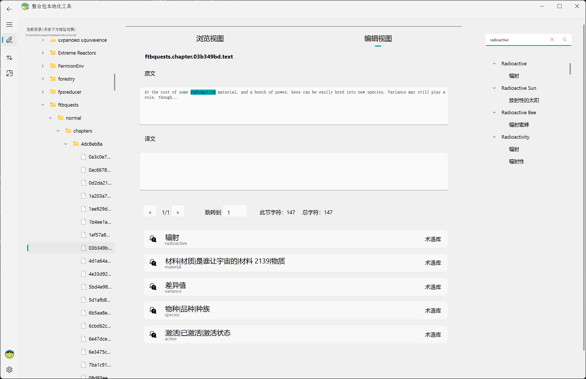
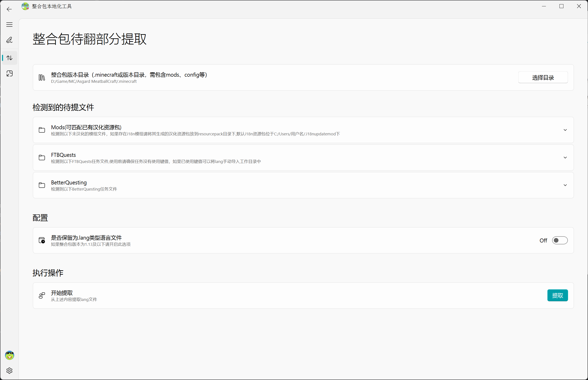
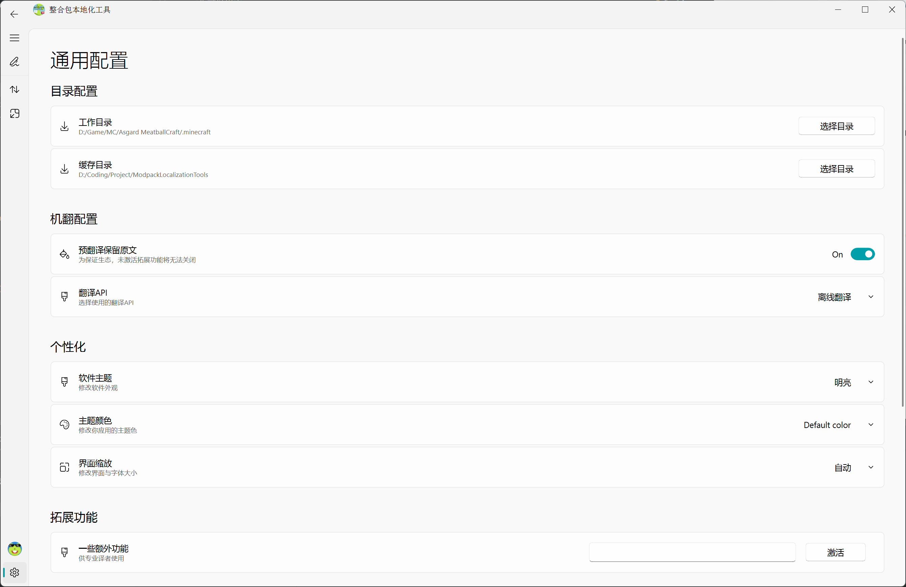

  

    
    
    

# 整合包本地化工具

### 介绍:

一个辅助翻译我的世界整合包汉化任务的工具集

你可以用它:
1. 快速找到整合包中需要翻译的任务或模组,并提取出相应语言文件
2. 生成机翻并进行在线润色
3. 自动生成汉化资源包
4. lang与json语言文件互相转化
5. MC模组术语查询
### 使用:
1. 首先进入右下角调整通用配置，选择使用的翻译API(离线翻译或[百度翻译api](bce.baidu.com))等
2. 提取整合包中待提取部分送入工作目录下
3. 进入工作台编辑
4. 生成汉化资源包，注意替换原先任务文件为local目录下的使用键值的文件
### 说明
1. 中断预翻译请务必使用终止翻译按钮
2. 保存进度功能用于将你已经润色完的汉化放入记忆库中供后续使用, 你可以在cache中找到相应记录
3. 文件浏览页面右键可以进行lang与json互相转化
4. 如果不需要为FTBQ提lang，你可以直接在文件浏览器中打开snbt文件对其进行直接编辑
5. 维护翻译生态,请不要直接发布未经人工润色的机翻
### 效果：

 
    
    
    

### 可能遇到的问题
1. 闪退，大概率为异常操作
2. API调用出错，网络环境不佳或翻译的文本有误

### 未来的计划
1. 支持对kubejs等更多类型硬编码的处理
2. 完成LangChain设计以方便后续对接ChatGLM2等大语言模型,以期辅助进行硬编码处理以及带来更好翻译效果
### 感谢
1. [snbtlib](https://github.com/Tryanks/python-snbtlib)--提供snbt文本解析
2. [i18n-dict](https://github.com/CFPATools/i18n-dict)--模组术语库
### Tips
1. 为了获取更好的翻译效果，如果使用百度翻译api建议先在百度翻译api中扩充自己的术语库，原版术语可以参考[CFPA术语库](https://github.com/CFPAOrg/Glossary)
2. 如果你有更好的思路或者发现了某些bug，欢迎在此发起issue或pr！

