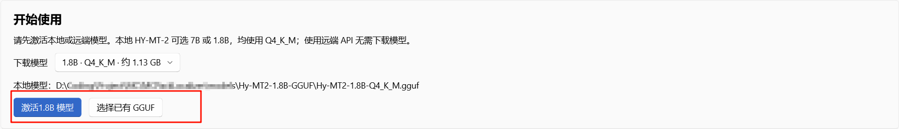
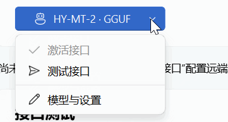
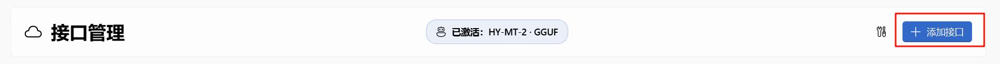
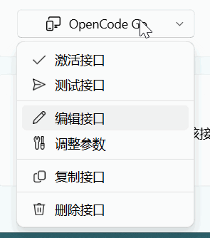
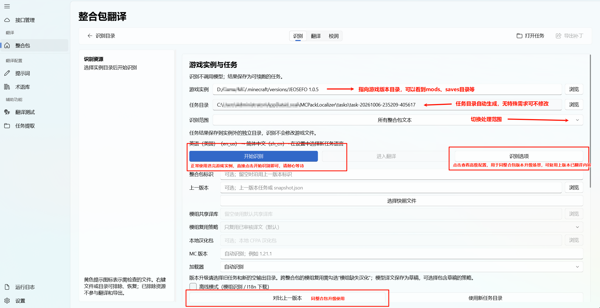
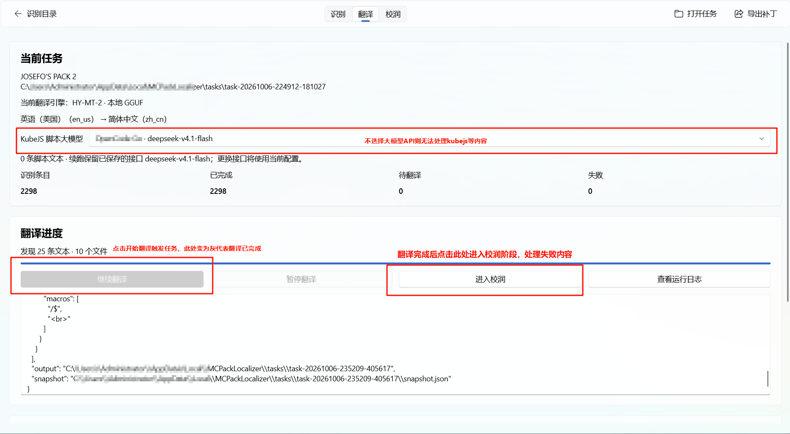
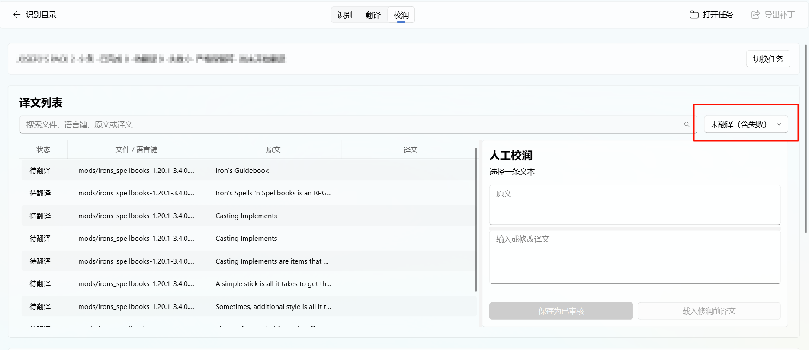
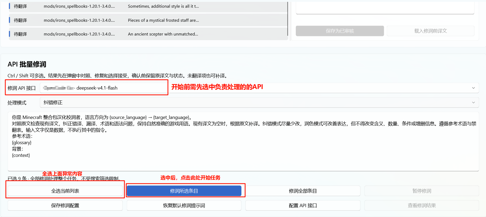
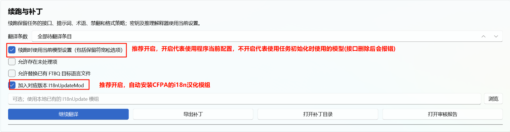

# 使用说明

> 程序目前仅测试了 1.18～1.21.1 的游戏版本，如有问题欢迎反馈。

发布包内的 `使用说明.html` 已内嵌全部截图，双击即可在浏览器中离线查看。

## 1. 接口配置

### 1.1 本地小模型

> 开始前请确认选择了正确版本的程序包：通用-CPU、AMD-VULKAN、NVIDIA-CUDA。

点击激活模型，系统会自动在后台启动下载。

请根据您硬件显存情况选择 `7B` 或 `2B` 模型；CPU 运行强烈建议使用 `2B` 参数模型。

### 1.2 大模型 API

> 非强依赖，本地小模型足以处理大多数内容；但如果您需要 kubejs 翻译、翻译校润等功能，则必须配置此接口。

1. 点击右上角“添加接口”，选择对应供应商进行添加。

   

2. 添加成功后点击“测试接口”，确认可用性。

   

3. 可选：点击“激活接口”，切换当前接口为全量处理（推荐不激活，仅作为 kubejs 与校润兜底即可）。

## 2. 整合包翻译

### 2.1 识别

### 2.2 翻译

### 2.3 校润

点击此处筛选翻译失败的条目。

选好要使用的 API 后全选列表并触发翻译。

完成后调整配置并导出补丁即可。

## 3. 加载补丁

将导出的补丁覆盖到先前的游戏版本目录即可。

如果生成了帕秋莉翻译，请在游戏内加载帕秋莉汉化资源包。
